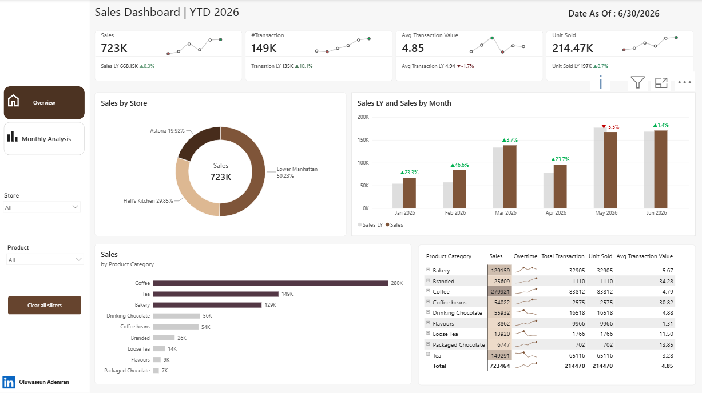
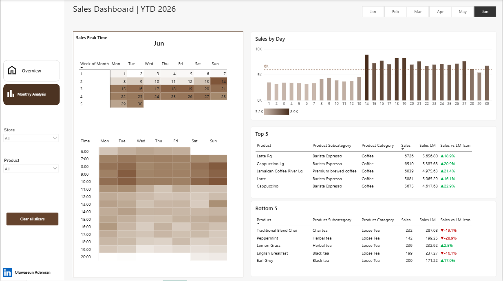

# ☕ Coffee Shop Sales Dashboard

An interactive Power BI dashboard tracking year-to-date sales performance for a multi-location coffee shop chain — built to surface store performance, product mix, and peak trading times for stakeholders making staffing and inventory decisions.

---

## 📊 Project Overview

This dashboard answers three core business questions for a coffee retailer operating across multiple New York locations:

1. **How is YTD sales performance trending** against last year, and which stores and product categories are driving it?
2. **When are the actual peak trading hours and days** — down to time-of-day and week-of-month — so staffing can be matched to demand?
3. **Which products are winning and which are underperforming**, month over month?

## 🗂️ Dataset

- **Domain:** Retail sales, coffee shop chain (Astoria, Hell's Kitchen, Lower Manhattan locations)
- **Grain:** Transaction-level sales data (`FACT_Transaction`, including transaction time)
- **Source:** *[add your dataset source/link here]*

## 🧱 Data Model

A proper star schema: one fact table joined to three dimension tables.

| Table | Type | Key fields |
|---|---|---|
| `FACT_Transaction` | Fact | Time, transaction-level sales records |
| `DIM_Stores` | Dimension | Store |
| `DIM_Product` | Dimension | Product, Product Category, Product Subcategory |
| `DIM_Date` | Dimension | Day, Week Day, Week of Month, Month Name, Month Year |

## 🧮 Key DAX Measures

| Measure | Purpose |
|---|---|
| `Sales` | Core sales total |
| `Sales LY` | Sales, same period last year (YoY comparison) |
| `Sales LM` | Sales, last month (MoM comparison) |
| `Sales vs LM Icon` | Directional indicator for month-over-month sales movement |
| `#Transaction` | Transaction count |
| `Total Transaction` | Transaction total for table breakdowns |
| `Avg Transaction Value` | Sales divided by transaction count |
| `Unit Sold` | Units sold |
| `Date As Of` | Dynamic "data current as of" label |

## 🛠️ Tools & Techniques

- **Power BI** — star-schema data modelling, report design, DAX
- **DAX** — YoY (`Sales LY`) and MoM (`Sales LM`) comparison measures, plus a directional icon measure for quick visual scanning
- **Sparkline visual calculations** embedded directly in the product category matrix, driven by `DIM_Date.Month Year`
- **Calendar heatmap visual** — week-of-month × day-of-week grid showing sales intensity by date
- **Time-of-day heatmap** — hour × day-of-week grid identifying peak trading windows
- **Custom theme** — warm brown/cream palette matched to the coffee retail subject matter

## 📄 Report Pages

1. **Overview** — headline KPIs (Sales, Transactions, Avg Transaction Value, Units Sold) with YoY deltas and trend sparklines; sales by store (donut); sales by product category (bar); YTD sales trend vs last year (Jan–Jun); product category performance table with inline trend sparklines
2. **Monthly Analysis** — calendar heatmap showing daily sales intensity for the selected month; time-of-day × day-of-week heatmap identifying peak trading hours; daily sales bar chart with an average reference line; Top 5 and Bottom 5 performing products by sales, with month-over-month comparison

## 🎛️ Interactivity

- Store and Product slicers apply across both report pages
- Month selector (Jan–Jun 2026) drives the Monthly Analysis page
- "Clear all slicers" button for quick reset

## 📸 Screenshots

*(Add exported screenshots of each page here)*

## 💡 Key Insights

*(Fill in 2-4 sentence bullets once you've reviewed the full data, e.g.:)*
- **[Store]** is the top-performing location, contributing **[X]%** of total YTD sales
- **[Product category]** significantly outperforms other categories, while **[category]** consistently underperforms
- Peak trading occurs on **[day(s)]** between **[time range]**, suggesting staffing should be weighted accordingly

## 🚀 How to Use

1. Download the `.pbix` file
2. Open in [Power BI Desktop](https://powerbi.microsoft.com/desktop/) (free)
3. Use the Store and Product slicers, or the month selector on the Monthly Analysis page, to filter the view

## 👤 Author

**Michael Oluwaseun**
Power BI Specialist | PL-300 Certified
[LinkedIn](#) · [Portfolio](#)
