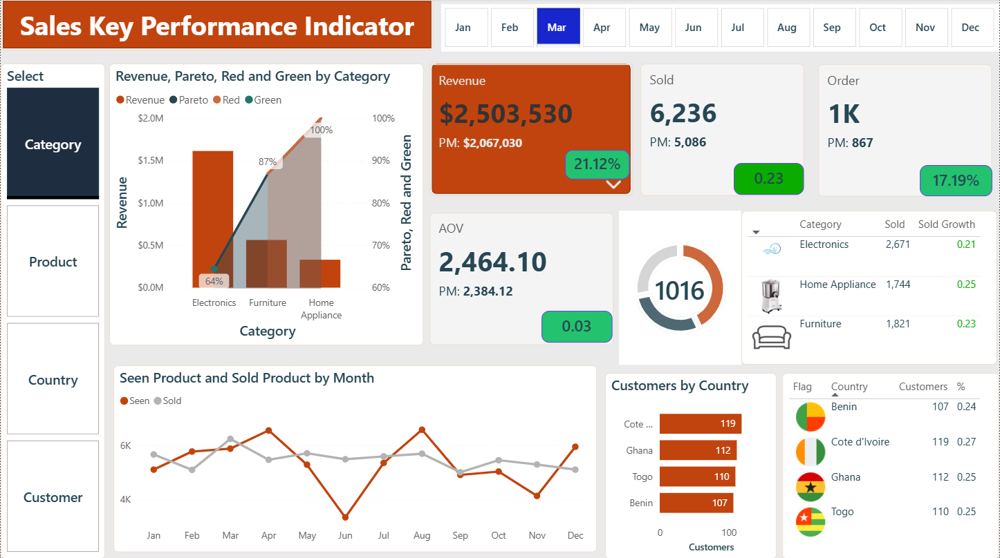
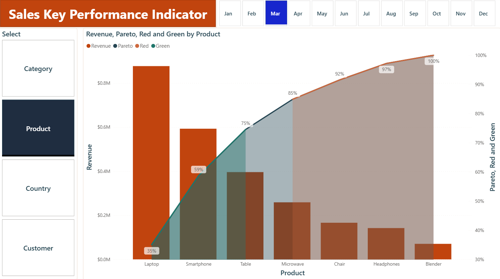
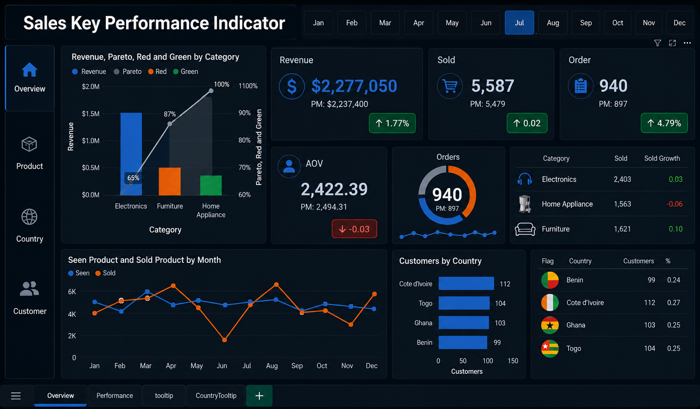

# Sales KPI Dashboard — Power BI

A sales performance dashboard built around a star-schema data model, tracking Revenue, Orders, Average Order Value (AOV), Units Sold, and Customer count — each with month-over-month growth tracking baked in as DAX measures.

## Screenshots

   

   


## Data Model

**Fact table:** `Sales` (SaleID, OrderID, ProductID, CustomerID, Date, Quantity, TotalAmount, SeenCount)

**Dimension tables:**
| Table | Purpose |
|---|---|
| `Products` | Product catalogue — ProductID, ProductName, Category, Price, SeenCount, Img |
| `Products Img` | Category-level image lookup |
| `Customers` | CustomerID, Name, Country, TotalVisits, Flag |
| `Country Flags` | Country → flag image lookup |
| `Calendar` | Custom date table (Date, Month, Year, MonthIndex, Month Initial) |
| `_measure` | Disconnected table used purely to house the DAX measures |
| `Parato Param` | Field parameter table driving the report's Pareto (80/20) visual |

### Relationships

| From | To | Type |
|---|---|---|
| Sales[ProductID] | Products[ProductID] | Many-to-one |
| Sales[CustomerID] | Customers[CustomerID] | Many-to-one |
| Sales[Date] | Calendar[Date] | Many-to-one |
| Products[Category] | Products Img[Category] | Many-to-one |
| Customers[Country] | Country Flags[Country] | Many-to-one |

This is a standard star schema: one central `Sales` fact table joined out to `Products`, `Customers`, and `Calendar`, with two small lookup tables (`Products Img`, `Country Flags`) feeding images into visuals based on category and country.

## Report Pages

| Page | Contents |
|---|---|
| **Overview** | 23 visuals — KPI cards (Revenue, Orders, AOV, Units Sold), a clustered column chart, line chart, donut chart, two tables, a clustered bar chart, a combo chart, an advanced slicer, action buttons, and shape/decorative elements |
| **Performance** | Combo chart (line + clustered column) with two advanced slicers for filtering |
| **Tooltip / CountryTooltip** | Custom hover tooltip pages used by the visuals above |

The report uses a custom theme (**Sales KPI Sunset Theme**) rather than a default Power BI theme.

## DAX Measures

All measures live in a disconnected `_measure` table. Each core metric (Revenue, Orders, AOV, Units Sold) has a matching **Previous Month** and **Growth %** measure, giving every KPI card a built-in MoM comparison.

### Revenue
```DAX
Revenue = SUM(Sales[TotalAmount])
```
```DAX
Revenue PM =
    CALCULATE(
        [Revenue],
        PREVIOUSMONTH('Calendar'[Date]))
```
```DAX
Revenue Growth =
    DIVIDE(
        [Revenue] - [Revenue PM],
        [Revenue PM])
```

### Orders
```DAX
Order = DISTINCTCOUNT(Sales[OrderID])
```
```DAX
Order PM =
    CALCULATE(
        [Order],
        PREVIOUSMONTH('Calendar'[Date])
    )
```
```DAX
Orders Growth = DIVIDE(
    [Order] - [Order PM],
    [Order PM]
)
```

### Average Order Value (AOV)
```DAX
AOV = DIVIDE(
    [Revenue],
    [Order]
)
```
```DAX
AOV PM =
    CALCULATE(
        [AOV],
        PREVIOUSMONTH('Calendar'[Date])
    )
```
```DAX
AOV Growth =
    DIVIDE(
        [AOV] - [AOV PM],
        [AOV PM]
    )
```

### Units Sold
```DAX
Sold = SUM(Sales[Quantity])
```
```DAX
Sold PM =
    CALCULATE(
        [Sold],
        PREVIOUSMONTH('Calendar'[Date])
    )
```
```DAX
Sold Growth =
    DIVIDE(
        [Sold] - [Sold PM],
        [Sold PM])
```

### Customers
```DAX
Customers = DISTINCTCOUNT(Sales[CustomerID])
```
```DAX
Customer % of Country =
    DIVIDE(
        [Customers],
        CALCULATE(
            [Customers],
            ALL(Customers)
        )
    )
```

### Other
```DAX
Seen = SUM(Sales[SeenCount])
```

## Power Query / M Transformation Steps

> **Not available in this file.** The `.pbit` template retains the data model and report layout, but Power BI templates strip the query load steps (M code) and cached data by design — that logic only exists in the source `.pbix`. If you have the original `.pbix`, the M steps can be pulled from there and added here.

## Tech Stack

- Power BI Desktop
- DAX (time intelligence via `PREVIOUSMONTH`, growth ratios via `DIVIDE`)
- Custom Power BI theme
