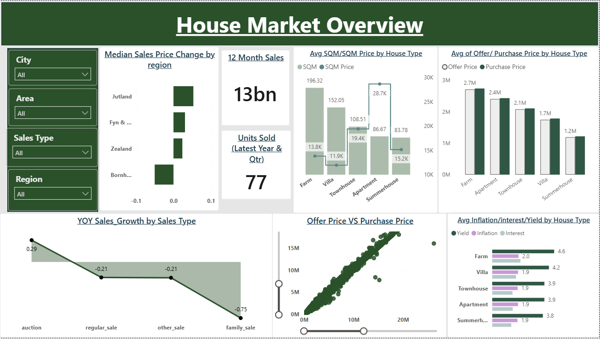
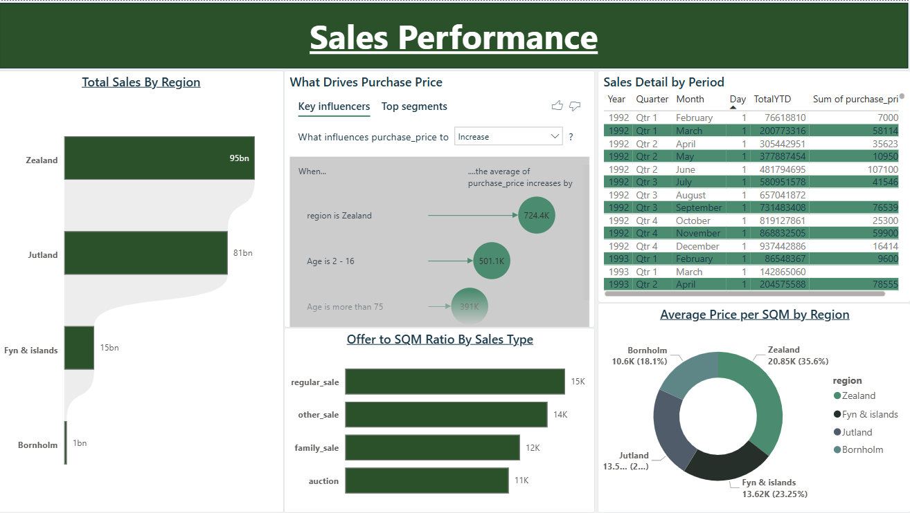

# 🏠 Housing Market Performance Dashboard

An interactive Power BI dashboard analysing residential property sales performance, pricing trends, and the economic drivers behind purchase prices — built to surface actionable insight for stakeholders tracking regional market performance.


---

## 📊 Project Overview

This project analyses residential property transactions to answer three core business questions:

1. **How is sales performance trending** across regions, time periods, and sales types?
2. **How closely do offer prices track final purchase prices**, and where is negotiation leverage strongest?
3. **What drives purchase price** — property size, house type, or macroeconomic conditions (inflation, interest rates, mortgage bond yields)?

The dashboard is built across multiple report pages, moving from a high-level performance overview into deeper segment-level and driver analysis.

## 🗂️ Dataset

- **Domain:** Residential property sales (Denmark)
- **Grain:** One row per property transaction
- **Key fields:** region, area, city, house type, sales type, offer price, purchase price, property size (sqm), price per sqm, property age, annual inflation rate, nominal interest rate, mortgage credit bond yield
- **Source:** *[add your dataset source/link here]*
- **Storage & preparation:** Data was connected via **Google BigQuery**, where initial data cleaning (handling nulls, standardising field formats, and filtering out invalid records) was carried out before the dataset was pulled into Power BI

## 🛠️ Tools & Techniques

- **Google BigQuery** — data storage and initial data cleaning/preparation
- **Power BI** — data modelling, report design, DAX
- **Power Query (M)** — additional data shaping and cleaning after import
- **DAX** — custom measures for YoY growth, YTD totals, and ratio calculations
- **Key Influencers (AI visual)** — automated driver analysis on purchase price
- **Custom theme** — branded colour palette and typography for a polished, non-default look

## ☁️ Data Pipeline

1. Raw housing data loaded into **Google BigQuery**
2. Data cleaning performed in BigQuery (null handling, format standardisation, invalid record filtering) — see screenshot below
3. Cleaned dataset connected to Power BI via the BigQuery connector
4. Additional shaping and modelling done in Power Query and the Power BI data model


## 🧮 Key DAX Measures

| Measure | Purpose |
|---|---|
| `YOY_Sales_Growth` | Year-over-year sales growth by sales type |
| `Median Sales Price Change` | Regional price movement |
| `Units sold in Latest Year & Quarter` | Current-period volume KPI |
| `Last 12 Month Sales` | Trailing 12-month sales total |
| `Sales By Region` | Regional sales aggregation |
| `TotalYTD` | Year-to-date running total |
| `AvgPricePerSQM` | Average price normalised by property size |
| `Offer to SQM Ratio` | Offer price efficiency relative to property size |


## 📄 Report Pages

1. **Market Overview** — headline KPIs, YoY sales growth by type, offer vs. purchase price relationship, regional price movement
2. **Sales Performance** — regional sales breakdown, sales detail by period, price-per-sqm by region, AI-driven purchase price drivers
3. **House Type Analysis** — offer/purchase price, economic indicators, and size/price trends by house type, with city/area/region/sales-type filtering

## 📸 Screenshots


```


```

## 💡 Key Insights

- Sales growth is strongest in **[region]**, driven by **[sales type]**
- Offer-to-purchase price gaps are widest for **[house type]**, suggesting greater negotiation flexibility in that segment
- **[Economic indicator]** shows the strongest relationship with purchase price per the Key Influencers analysis

## 🚀 How to Use

1. Download `Housing_Project.pbix`
2. Open in [Power BI Desktop](https://powerbi.microsoft.com/desktop/) (free)
3. Use the slicers on the House Type Analysis page to filter by city, area, sales type, or region

## 👤 Author

**Michael Oluwaseun**
Power BI Specialist | PL-300 Certified
[LinkedIn](#) · [Portfolio](#)

